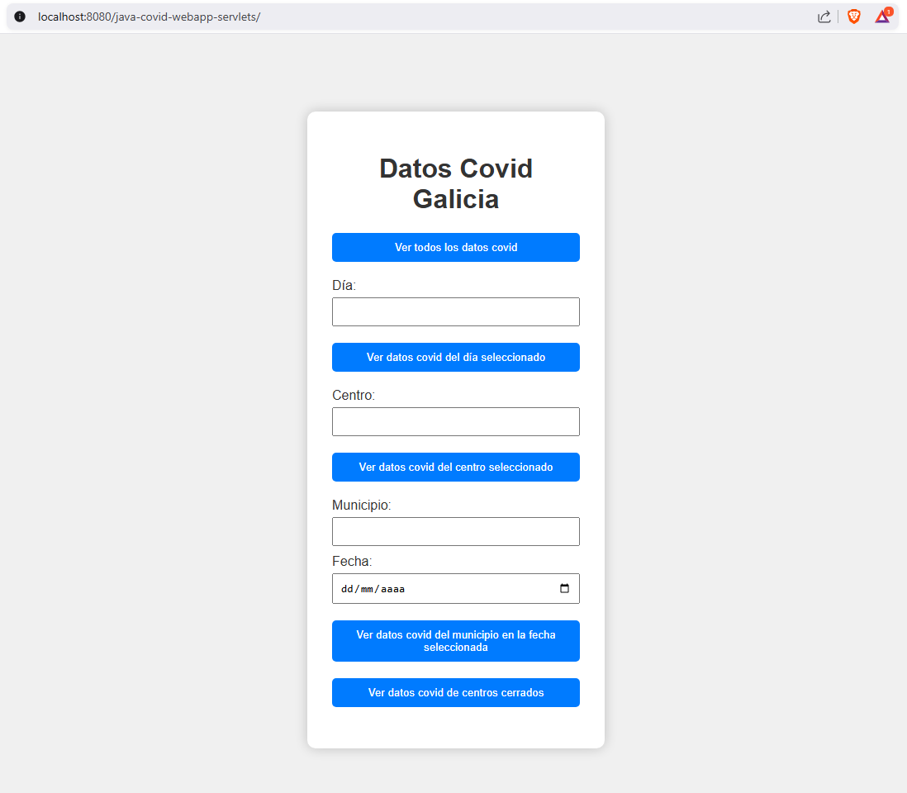
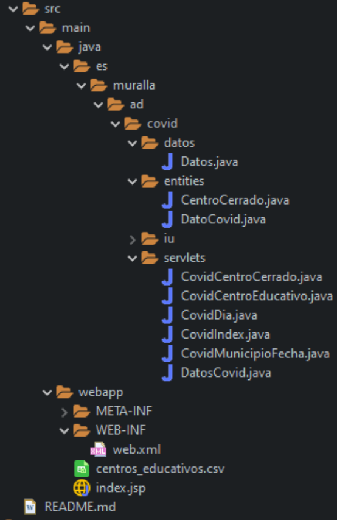

# Java COVID WebApp (Servlets)

Una **interfaz web** basada en **Java Servlets** que permite visualizar datos de COVID-19 de centros educativos en Galicia a partir de un archivo CSV.

---

## 📋 Índice

- [Java COVID WebApp (Servlets)](#java-covid-webapp-servlets)
  - [📋 Índice](#-índice)
  - [Descripción](#descripción)
  - [Requisitos](#requisitos)
  - [Estructura del Proyecto](#estructura-del-proyecto)

---

## Descripción

Este proyecto muestra cómo consumir datos de COVID-19 desde un CSV, procesarlos con Java y Servlets, y desplegar una interfaz web simple para visualizar estadísticas con diferentes filtros.

---

## Requisitos

- Java 21  
- **Servidor de Servlets** (Apache Tomcat)  
- CSV con datos de COVID-19 centros eductivos (ejemplo en `/src/main/resources/centros_educativos.csv`)  

---

## Estructura del Proyecto

            

